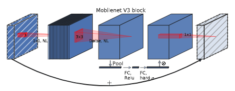
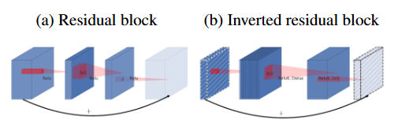
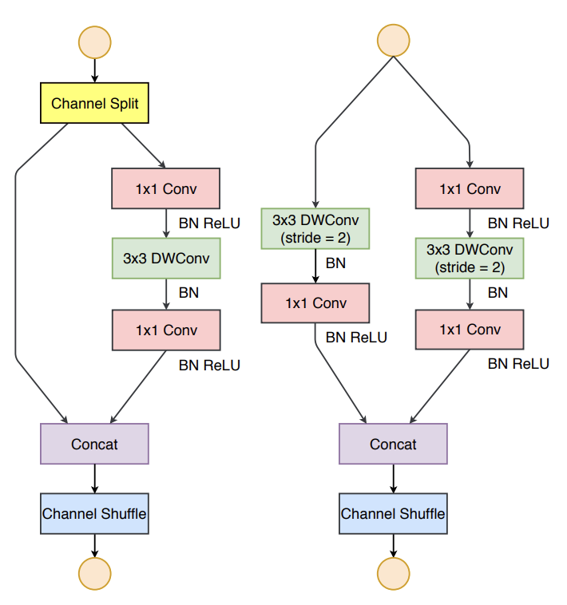
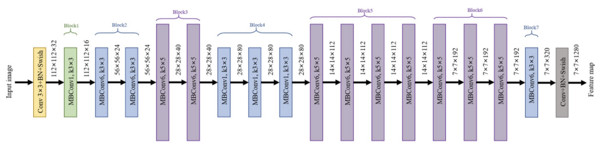
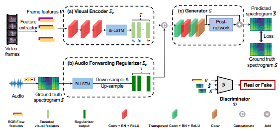

# Evaluating Convolutional Neural Networks (CNNs) performance in Audio Anomaly Detection in High-Noise Agricultural Environments  
**CSC173 Intelligent Systems Final Project**  
*Mindanao State University - Iligan Institute of Technology*  
**Student:** [Your Full Name], [Student ID]  
**Semester:** [e.g., AY 2025-2026 Sem 1]  
 

## Abstract
The
[150-250 words: Summarize problem (e.g., "Urban waste sorting in Mindanao"), dataset, deep CV method (e.g., YOLOv8 fine-tuned on custom trash images), key results (e.g., 92% mAP), and contributions.][web:25][web:41]

## Table of Contents
- [Introduction](#introduction)
- [Related Work](#related-work)
- [Methodology](#methodology)
- [Experiments & Results](#experiments--results)
- [Discussion](#discussion)
- [Ethical Considerations](#ethical-considerations)
- [Conclusion](#conclusion)
- [Installation](#installation)
- [References](#references)

## Introduction
### Problem Statement
&nbsp;&nbsp;&nbsp;&nbsp; Heavy background noise is rampant in the agricultural setting, sound emitted by livestock, machinery for processing crop, different weather conditions to name a few, and is much more apparent in the Philippines where the limited space for processing agricultural goods means overlapping sound profiles.  
&nbsp;&nbsp;&nbsp;&nbsp; The problem then is that in order for real-world application of detection systems in these settings, the discernment capability of AI models should be tested in datasets that replicate these scenarios.
&nbsp;&nbsp;&nbsp;&nbsp; Notably on discerining between resonant and damped noises, add the fact as well that there are other common sounds in farms, and that there are sounds that act as background noise
&nbsp;&nbsp;&nbsp;&nbsp; The project then aims to test the capability of different CNN models given different data availability environments in detecting 3 distinct classes: Resonant, Damp, and Common. Background noise will also be injected to the training dataset which are the following sound of : rain falling on metal roofing, and crickets chirping

### Objectives
- Apply data augmentation techniques to the training dataset and split them into the following groups:  
    - No data augmentation
    - Audio augmentation only
    - Spectrogram Augmentation only
    - Audio augmentation then Spectrogram augmentation 
- Train multiple pre-trained computer vision models using the different training dataset grouping to discern between 3 classes [resonant, damp, common] that have been split based on their spectral morphology.
- Validate their training per epoch
- Evaluate and compare their performance based on the following metrics:
    - Accuracy
    - Precision
    - Recall
    - F-1 Score

 [web:41]

## Related Work
- [EfficientNet: Rethinking Model Scaling for Convolutional Neural Networks ](https://arxiv.org/abs/1905.11946)
- [Designing Network Design Spaces](https://arxiv.org/abs/2003.13678)
- [MobileNetV2: Inverted Residuals and Linear Bottlenecks](https://arxiv.org/abs/1801.04381)
- [Searching for MobileNetV3](https://arxiv.org/abs/1905.02244)
- [ShuffleNet V2: Practical Guidelines for Efficient CNN Architecture Design](https://arxiv.org/abs/1807.11164)

## Methodology
### Dataset
- Source: ESC-50 dataset
- Split: 5-fold Split 
- Preprocessing: Augmentation, resizing to 126x126 (to be verified) [web:41]

### Architecture
MobileNetV3:  

- Backbone: Mobile Inverted Bottleneck blocks (MBConv) with Squeeze-and-Excitation and Hard-Swish activation.
- Head: Global Average Pooling, then two Fully Connected layers with Hard-Swish and Dropout activation functions.  

MobileNetV2:  

- Backbone: Inverted Residual blocks with linear bottlenecks and ReLU6 activation.
- Head: 1x1 Convolution, Global Average Pooling, Dropout, and a single Fully Connected layer.  

ShuffleNetV2:

- Backbone: Shuffle Units with Channel Shuffle and depthwise separable convolutions.
- Head: 1x1 Convolution Global Average Pooling, and a single Fully Connected layer.  

EfficientNet:

- Backbone: Mobile Inverted bottlenecks with Squeeze-and-Excitation
- Head: Global Average Pooling, 1x1 Convolution, and Fully Connected Layers  

RegNet:

- Backbone: Quantized linear stack of Residual blocks with Group Convolutions and Squeeze-and-Excitation.
- Head: Global Average Pooling, a single Fully Connected layer.

Hyperparameters: Table below for all models

| Parameter | Value |
|-----------|-------|
| Batch Size | 32 |
| Learning Rate | 0.01 |
| Epochs | 50 |
| Optimizer | Adaptive Moment Estimation (Adam) |

### Training Code Snippet
train.py excerpt
model = YOLO('yolov8n.pt')
model.train(data='dataset.yaml', epochs=100, imgsz=640)

## Experiments & Results
### Metrics
| Model | Accuracy | Precision | Recall | F-1 Score |
|-------|---------|-----------|--------|---------------------|
| Baseline (YOLOv8n) | 85% | 0.87 | 0.82 | 12 |
| **Ours (Fine-tuned)** | **92%** | **0.94** | **0.89** | **15** |

### Demo

[Video: [CSC173_YourLastName_Final.mp4](demo/CSC173_YourLastName_Final.mp4)] [web:41]

## Discussion
- Strengths: [e.g., Handles occluded trash well]
- Limitations: [e.g., Low-light performance]
- Insights: [e.g., Data augmentation boosted +7% mAP] [web:25]

## Ethical Considerations
- Bias: Dataset skewed toward plastic/metal; rural waste underrepresented
- Privacy: No faces in training data
- Misuse: Potential for surveillance if repurposed [web:41]

## Conclusion
[Key achievements and 2-3 future directions, e.g., Deploy to Raspberry Pi for IoT.]

## Installation
1. Clone repo: `git clone https://github.com/yourusername/CSC173-DeepCV-YourLastName`
2. Install deps: `pip install -r requirements.txt`
3. Download weights: See `models/` or run `download_weights.sh` [web:22][web:25]

**requirements.txt:**
torch>=2.0
ultralytics
opencv-python
albumentations

## References
[1] Jocher, G., et al. "YOLOv8," Ultralytics, 2023.  
[2] Deng, J., et al. "ImageNet: A large-scale hierarchical image database," CVPR, 2009. [web:25]

## GitHub Pages
View this project site: [https://jjmmontemayor.github.io/CSC173-DeepCV-Montemayor/](https://jjmmontemayor.github.io/CSC173-DeepCV-Montemayor/) [web:32]
