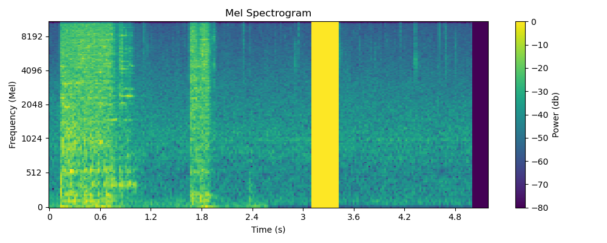
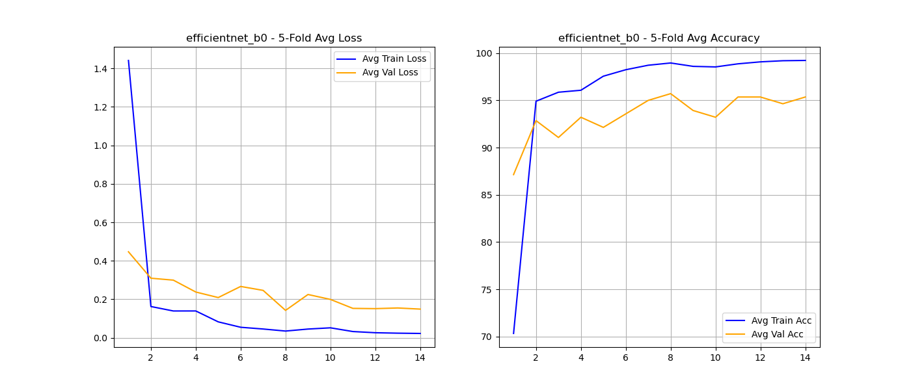

# CSC173 Deep Computer Vision Project Progress Report
**Student:** Mark Angelo L. Gallardo, 2022-0182  
**Date:** December 19, 2025   
**Repository:** [Click This](https://github.com/markangelogallardo/CSC173-DeepCV-Gallardo)  

## 📊 Current Status
| Milestone | Status | Notes |
|-----------|--------|-------|
| Dataset Preparation | ✅ Completed | 280 images downloaded/preprocessed |
| Data Augmentation | ✅ Completed| Generated 2520 images |
| Initial Training | ✅ Completed | Trained the 5 models accross |
| Baseline Evaluation | ⏳ In Progress | Coding automatic evaluator |
| Model Comparisons | ⏳ Not Started | Planned for later |

## 1. Dataset Progress
- **Total images:** 2520 (280 no augmentation, 560 audio augmentation, 560 spectrogram augmentation, 1120 hybrid ) 
- **Train/Val split:** 4 fold/ 1 fold (Train is combination of augmented and clean data while Val is from clean data)
- **Classes implemented:** Common, Resonant, Damp
- **Preprocessing applied:** Time Stretch, Pitch Shift, Noise Injection, Frequency Masking, Time Masking

**Sample data preview:**

## 2. Training Progress

**Training Curves (For EfficientNetb0)**

**Current Metrics:**  
[Training and Validation results]("train_val_results.csv")

## 3. Challenges Encountered & Solutions
| Issue | Status | Resolution |
|-------|--------|------------|
| Normalizing Augmented Data  |✅Completed| Implemented methods for ease of augmentation generation |
| Shape Diversity  |✅Completed| Included normalization of array size for ease in feeding to CNN |
| Unable to conduct 5-fold cross validation  |✅Completed| Implemented looping logic to go through different folds|

## 4. Next Steps (Before Final Submission)
- [✅] Complete training 
- [ ] Baseline comparison (vs. original pre-trained model)
- [ ] Record 5-min demo video
- [ ] Write complete README.md with results